## Frontend
```
cd /frontend

yarn

yarn dev - Развернуть локально

yarn generate - Сбилдить
```

## Backend

### Развернуть на локалке
```
cd /backend

Поместить .env файл из заметок в корень

yarn

yarn dev - Развернуть локально
```

### Деплой на хероку (пока нет сервера)

```
heroku login

cd /backend

git add .

git commit -am "Коммит с изменением"

git push heroku master
```

## Админка

### Создать блок
1. Разворачиваем админку локально (см. Backend)
2. Переходим по http://localhost:1337/admin/
3. Переходим в Content-Type Builder и создаем новый single type
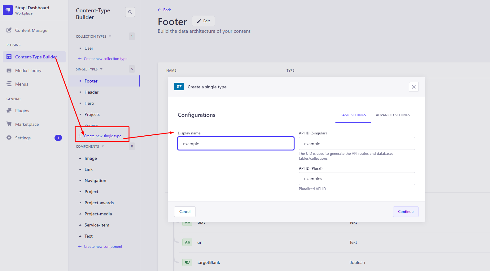
4. Выбираем поле Component
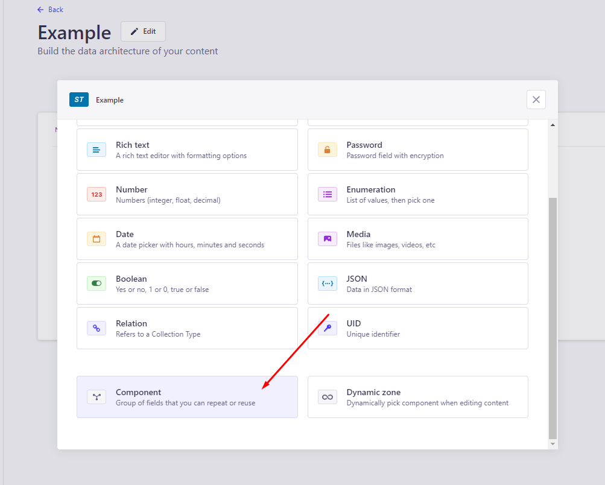
5. Если в Components есть нужный компонент, то выбираем "Use an existing component".
Если нет, то "Create a new component".
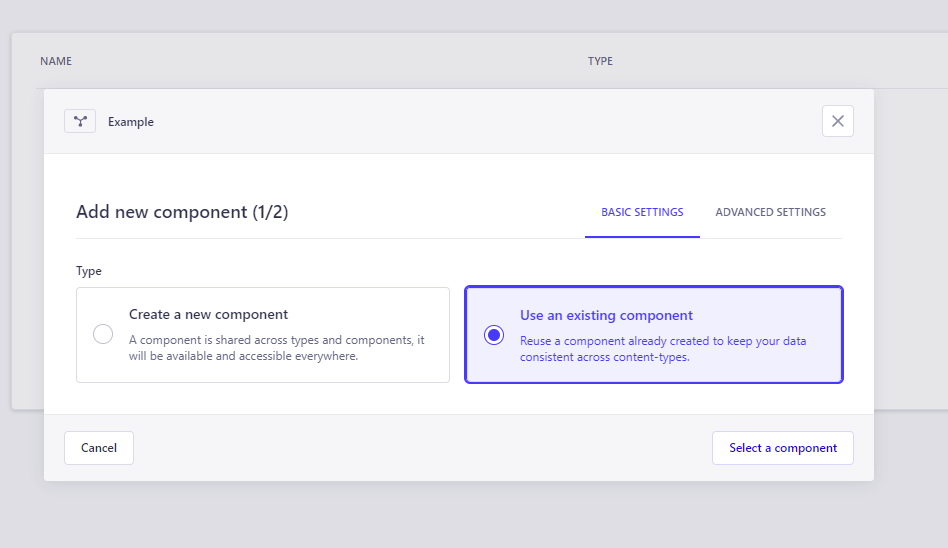
5. Выбираем тип компонента и именуем. Если хотим создать пополняемый список компонентов, то выбираем Reapetable, если поле предназначено для еденичного компонента, то Single.
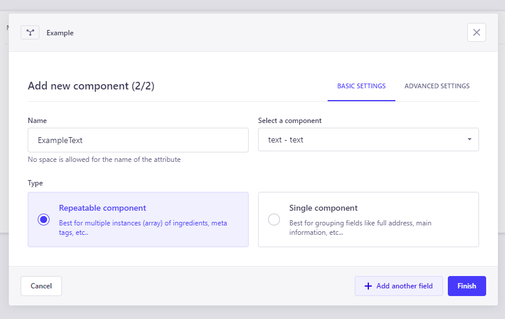
6. Жмем Save и ждем, пока изменения зафиксируются.
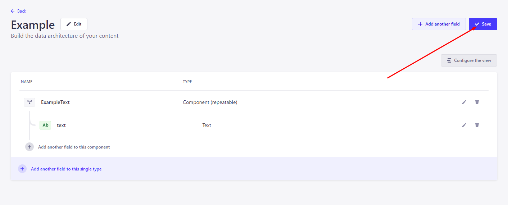
7. Идём в Settings - Roles - Public.
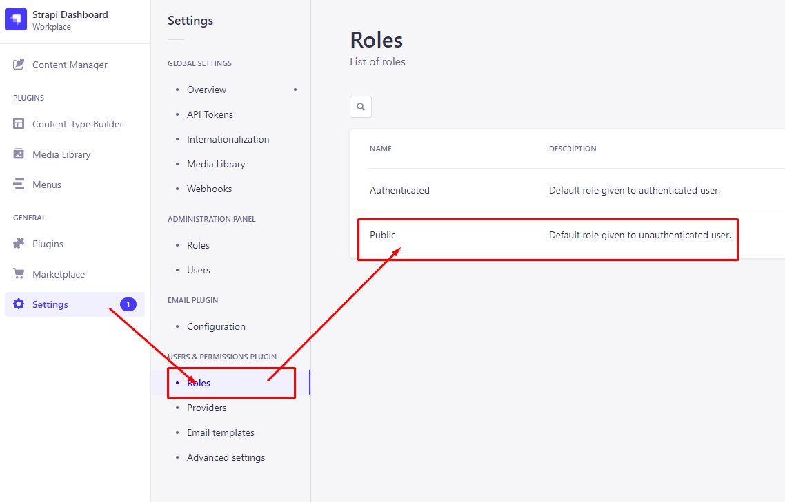
8. Ищем блок Permissions. Находим там наш Single type и выставляем галочку Find. Сохраняем. Теперь компонент доступен для обращения через /api или /graphql
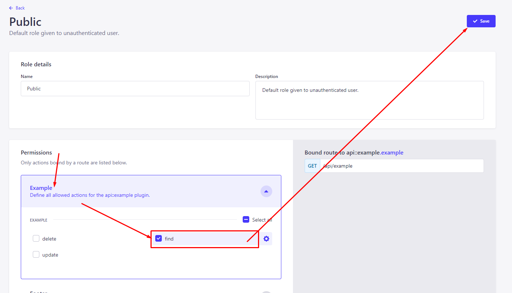
9. Идем в Content Manager. В Syngle types находим наш блок и добавляем контент. 
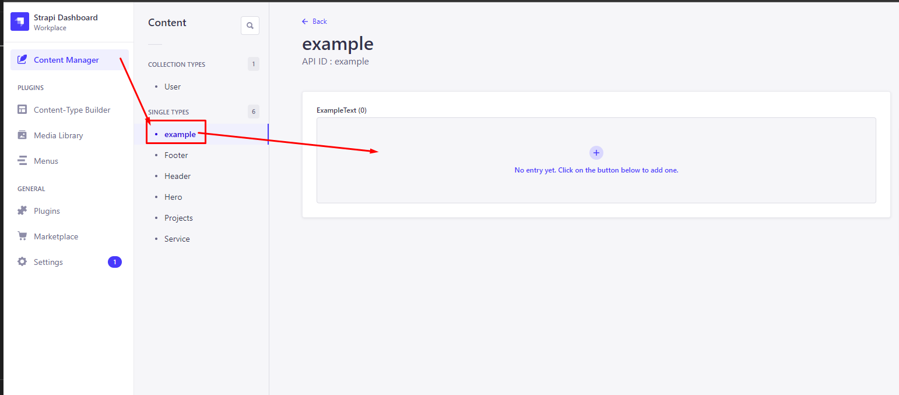
10. Заполняем все нужные поля, сохраняем и публикуем.
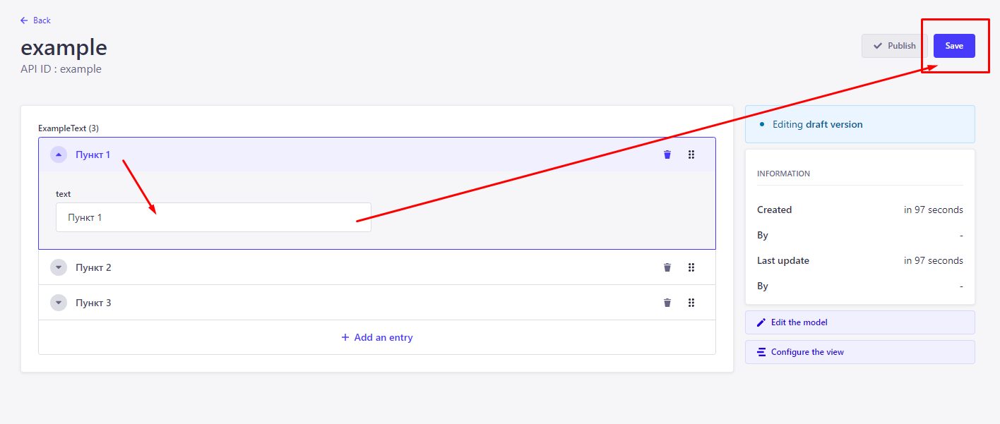
11. Переходим в плейграунд graphql по http://localhost:1337/graphql/ и пишем запрос за данными на языке graphql. В области справа будет отображаться ошибка или полученные данные в формате JSON. Эта площадка нужна для проверки правильности запроса. Если все правильно - копируем graphql запрос.
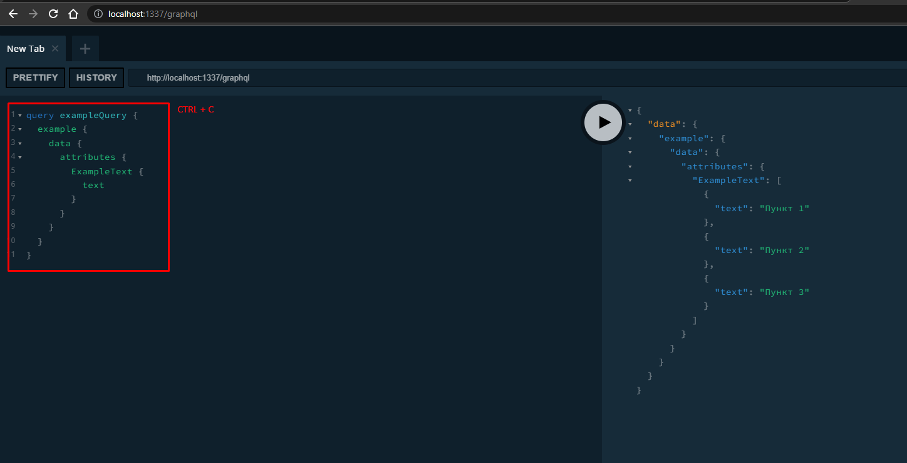
12. Переходим по пути "frontend/graphql/queries" и создаем файл для нашего запроса. Оформляем, как на скрине ниже.
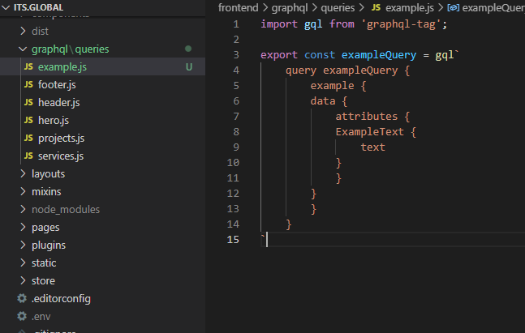
13. Используем, где нам нужно. P.S.: для списков ещё выводим в graphql id(генерируется самим strapi), чтобы прокинуть в key
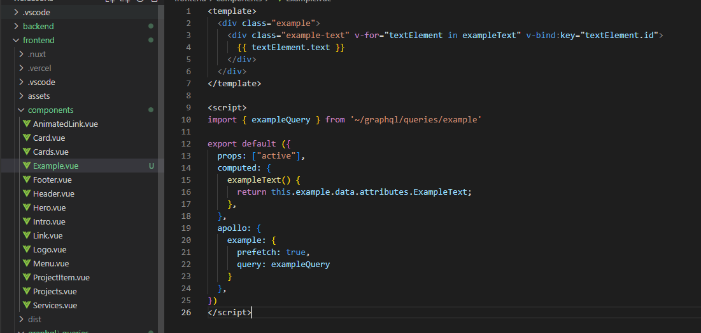